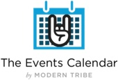
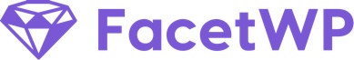
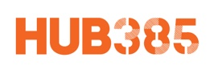
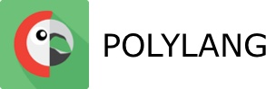
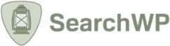
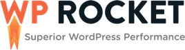
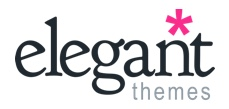
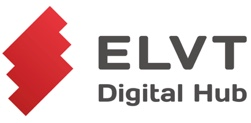

# WordPress Zagreb Meetup

Ovaj repozitorij sadrži prezentacije prošlih predavanja i predložak za prijavu budućih predavanja.

Ideja za ovaj repozitorij je došla od [zgphp](https://github.com/zgphp/zgphp-meetup-talks) grupe, gdje im je cilj bio da pojednostave proces prijave predavanja.

# Prijavi predavanje

Imaš super ideju vezanu uz WordPress o kojoj bi htio/htjela pričati? Radio/radila si na projektu i naučio/naučila si super stvari koje bi htio/htjela podijeliti s WordPress zajednicom? Ovo je mjesto za tebe 😄.

Proces prijave je veoma jednostavan:

1. Forkaj ovaj repozitorij
2. Kreiraj branch koji izgleda kao `tvoje-ime--naziv-predavanja` (e.g. `ivan-horvat--gutenberg-i-ti`)
3. Kopiraj [talk-description-template.md](https://github.com/wpcroatia/wp-zg-meetup/blob/master/.github/talk-description-template.md) iz `.github` direktorij i preimenuj ju da odgovara imenu brancha (korak broj 2)
4. Kopiraj preimenovanu datoteku u direktorij meetupa na kojem bi htio/htjela držati predavanje. Na primjer, ako želiš držati predavanje na 21. meetupu, kopiraj template u `meetups/2019/meetup#21` direktorij (meetupi se održavaju jednom svaka dva mjeseca)
5. Popuni detalje predloška
6. Napravi pull request

Nakon što je PR podnešen možda ostavimo neke komentare, ako je sve ok, PR će biti spojen i predavanje će biti zakazano za jedan od sljedećih meetupa 🙂.

# Ideje i želje za predavanja

Ako ne želiš držati predavanje (trema ili nešto treće), a imaš ideju o kojoj bi volio/volila pričati, otvori issue gdje ćeš opisati detalje o temi koja te zanima.

Prije nego otvoriš issue, prođi kroz [listu otvorenih issue-a](https://github.com/wpcroatia/wp-zg-meetup/issues) i provjeri postoji li slična tema već otvorena. Ako postoji samo ostavi palac gore 👍🏻 umijesto da kreiraš novi issue.

# Korisni linkovi

[WordPress Hrvatska meetup.com](https://www.meetup.com/wordpress-croatia)

[wpcroatia.com](https://wpcroatia.com)

[Facebook grupa WordPress Hrvatska](https://www.facebook.com/groups/wpcroatia/)

[Twitter wpcroatia](https://twitter.com/wpcroatia)

# Dosadašnji sponzori

<table width='100%'>
  <tr>
    <td align="center"></td>
    <td align="center"></td>
    <td align="center"></td>
  </tr>
  <tr>
    <td align="center"></td>
    <td align="center"></td>
    <td align="center"></td>
  </tr>
  <tr>
    <td align="center"></td>
    <td align="center"></td>
    <td align="center"></td>
  </tr>
  <tr>
    <td align="center"></td>
    <td align="center"></td>
    <td align="center"></td>
  </tr>
  <tr>
    <td align="center"></td>
    <td align="center"></td>
    <td align="center"></td>
  </tr>
  <tr>
    <td align="center"></td>
    <td align="center"></td>
    <td align="center"></td>
  </tr>
  <tr>
    <td align="center"></td>
    <td align="center"></td>
    <td align="center"></td>
  </tr>
  <tr>
    <td align="center"></td>
    <td align="center"></td>
    <td align="center"></td>
  </tr>
  <tr>
    <td align="center"></td>
    <td align="center"></td>
    <td align="center"></td>
  </tr>
  <tr>
    <td align="center"></td>
    <td align="center"></td>
    <td align="center"></td>
  </tr>
</table>

